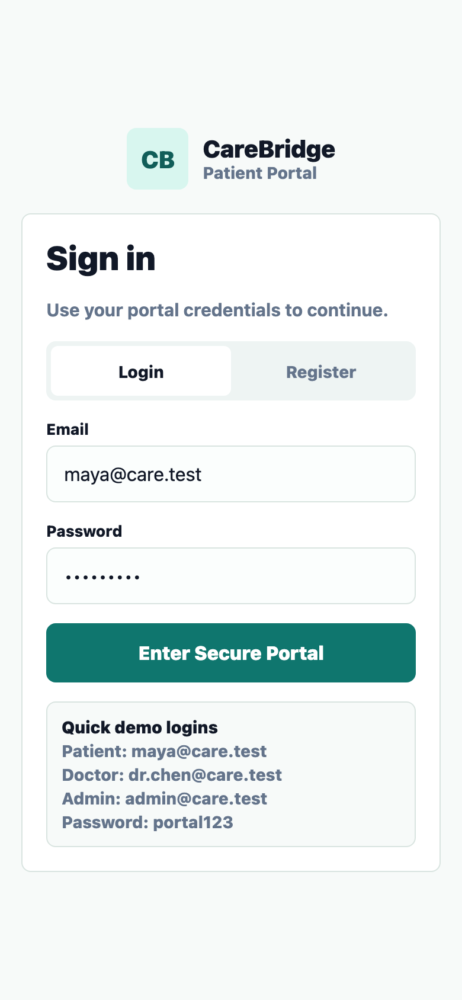
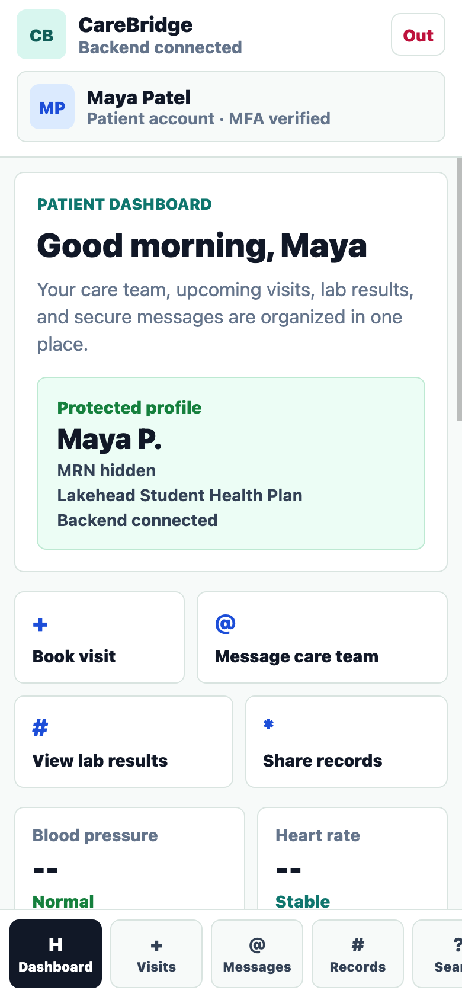
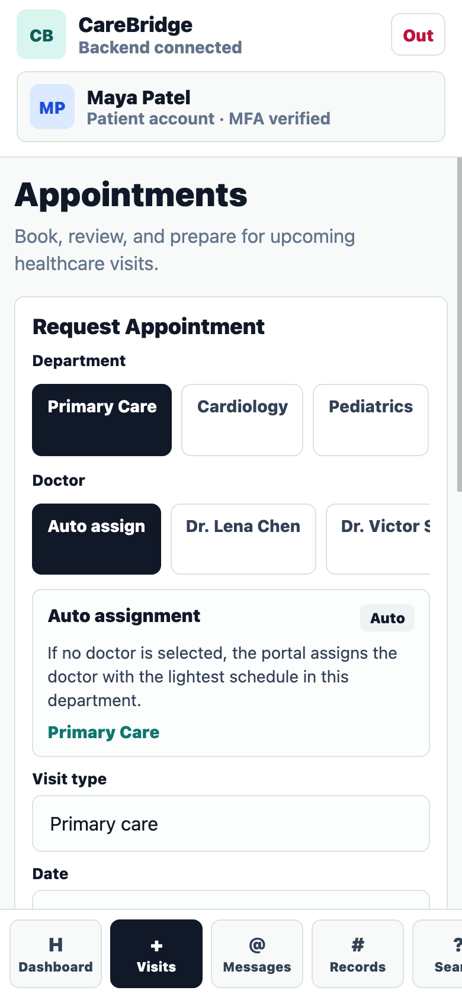
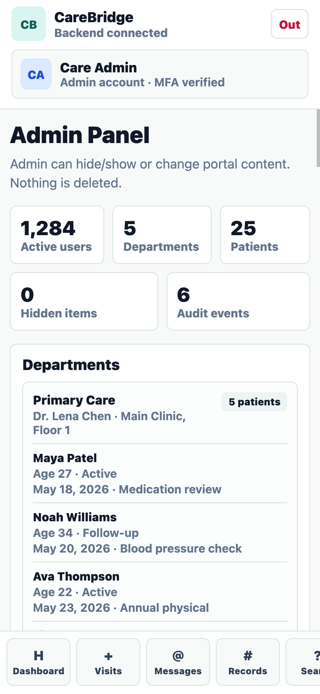

# CareBridge Patient Portal

CareBridge is a professional React Native/Expo patient portal with a local Express backend. It is designed for mobile presentation in Expo Go while also supporting Chrome/web demos.

The app demonstrates a real-world healthcare workflow across Patient, Doctor/Provider, and Admin roles: appointments, departments, doctor schedules, medical records, secure messages, profile updates, audit logs, and role-based access.

## Screenshots

| Login | Patient Dashboard |
| --- | --- |
|  |  |

| Appointment Booking | Admin Panel |
| --- | --- |
|  |  |

## Feature Overview

### Authentication and Roles

- Patient, Doctor/Provider, and Admin login
- User registration with role selection
- JWT-based backend authentication
- bcrypt password hashing
- Role-specific dashboards and navigation
- Protected admin-only audit logs

### Patient Portal

- Personalized patient dashboard
- Medical records and health profile
- Vitals summary
- Secure message center
- Appointment booking
- Department selection
- Doctor selection
- Automatic doctor assignment when no doctor is selected
- Notifications after doctor decisions or profile updates
- Mobile-first bottom tab navigation

### Doctor / Provider Portal

- Doctor dashboard
- Patient appointment request queue
- Approve or reject appointment requests
- Synced schedule updates after decisions
- Patient-specific profile update workflow
- Create new patient profiles
- View department patient lists
- Provider login accounts for every department doctor

### Admin Portal

- Full admin dashboard
- Department and patient overview
- Create new doctor/provider profiles
- Manage appointments, messages, and notifications
- Hide/show/change records without deleting data
- View security and activity audit logs
- Audit log is read-only and admin-only

### Departments and Scheduling

The demo data includes:

- 5 departments
- 5 patients per department
- 2 doctors per department
- 25 synthetic patients
- 10 department doctor accounts
- Doctor schedules synced with appointment requests

Departments:

- Primary Care
- Cardiology
- Pediatrics
- Dermatology
- Mental Health

### UI and Design

- Mobile-first interface for Expo Go
- Responsive web/tablet layout
- Animated login screen
- Animated screen transitions
- Animated cards, panels, metrics, tabs, and buttons
- Professional healthcare-style layout
- Clean simplified login page

## Tech Stack

- React Native
- Expo SDK 54
- React Native Web
- Node.js
- Express
- JWT
- bcryptjs
- In-memory demo data

## Quick Start

Run the backend and Expo app together:

```bash
./run-portal.sh
```

Then scan the QR code with Expo Go.

The launcher script:

- installs dependencies if missing
- starts the backend on `http://localhost:4000`
- detects your laptop LAN IP
- sets `EXPO_PUBLIC_API_URL`
- starts Expo in LAN mode

## Manual Run

Install dependencies:

```bash
npm install
```

Start backend:

```bash
npm run backend
```

Start Expo:

```bash
npm start
```

Start web preview:

```bash
npm run web
```

## Demo Credentials

All demo accounts use:

```text
portal123
```

Main accounts:

```text
Patient: maya@care.test
Doctor: dr.chen@care.test
Admin: admin@care.test
```

All department patient and doctor accounts are listed in:

```text
DEMO_CREDENTIALS.md
```

## Backend API

```text
GET    /api/health
POST   /api/auth/login
POST   /api/auth/register
GET    /api/portal
GET    /api/search
GET    /api/audit-logs
POST   /api/appointments
PATCH  /api/appointments/:id/status
POST   /api/messages
PATCH  /api/patient-profile
POST   /api/patients
POST   /api/doctors
PATCH  /api/admin/items/:collection/:id
```

## Project Structure

```text
App.js                 React Native/Expo mobile app
backend/server.js      Express API server
run-portal.sh          One-command backend + Expo launcher
DEMO_CREDENTIALS.md    Demo login accounts
docs/screenshots/      README screenshots
```

## Notes

- Data is stored in memory for classroom/demo use.
- Restarting the backend resets runtime-created profiles and requests.
- `node_modules`, `dist`, `.expo`, and backup files are ignored by git.
- The app works best on a real phone through Expo Go for presentation.
