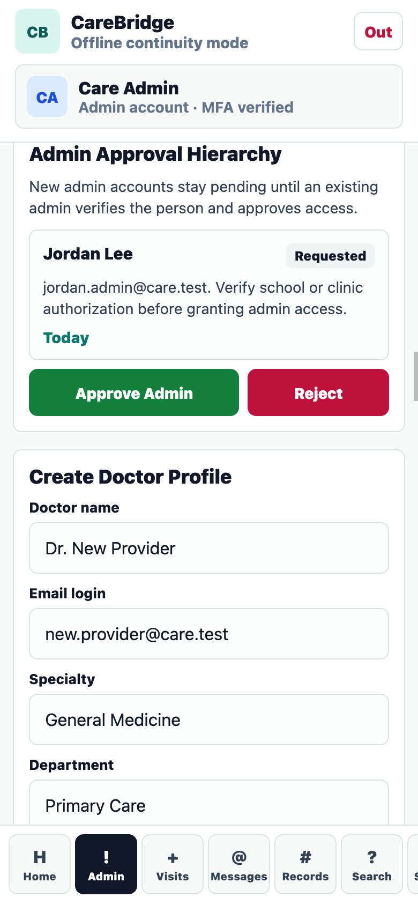
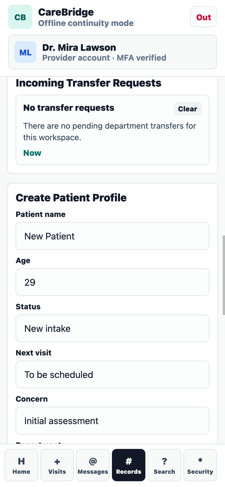

# CareBridge Patient Portal

CareBridge is a mobile-first patient portal built with React Native, Expo, and a small Express backend. The goal was to make the app feel like a practical clinic tool instead of a static school demo. Patients can book appointments and message their care team, doctors can manage department workflows, and admins can control access without deleting clinical history.

The project runs in Expo Go on a phone, in Android/iOS simulators, and in the browser through React Native Web.

## Screenshots

| Login | Patient Dashboard | Appointment Booking |
| --- | --- | --- |
|  |  |  |

| Admin Panel | Admin Approval | Provider Transfers |
| --- | --- | --- |
|  |  |  |

## What This App Covers

CareBridge has three connected workspaces: patient, provider, and admin. The data is synthetic, but the workflows are designed to behave like a real portal.

Patients can sign in, review their dashboard, search resources, view records, request appointments, and send secure messages. When booking an appointment, they can choose a doctor or leave the field open so the app assigns the doctor with the lightest schedule in that department.

Doctors see the patients and requests connected to their own department. They can approve or reject appointment requests, update patient summaries, create new patient profiles, and request a transfer when a patient needs another department.

Admins get the operational view. They can create doctor accounts, approve new admin requests, review audit logs, and hide or update content. The admin panel does not delete records, which keeps the demo closer to how a real healthcare system protects history.

## Key Features

- Separate patient, provider, and admin portals
- Secure login backed by JWT authentication
- Password hashing with bcrypt
- Browser session restore after refresh
- Inactivity auto-lock for security
- Mobile-first layout with tablet and desktop support
- Personalized dashboard for each role
- Search across records, messages, appointments, transfers, and resources
- Patient appointment booking with department and doctor selection
- Automatic doctor assignment based on schedule capacity
- Doctor approve/reject workflow for appointment requests
- Doctor schedule conflict checks
- Secure messages scoped by role
- Medical records scoped by patient, provider department, and admin access
- Patient profile updates with notifications
- Department transfer requests between provider teams
- Doctor-created patient profiles
- Admin-created doctor profiles
- Admin approval hierarchy for new admin accounts
- Admin-only audit log for security activity
- Hide/show/change controls with no delete action
- Local JSON persistence for demo state
- Screenshot automation for README images and UI checks

## Demo Clinic Data

The app starts with a ready-to-use clinic workspace:

- 5 departments
- 2 doctors in each department
- 5 patients in each department
- 25 seeded department patients
- Seeded appointments, messages, schedules, records, notifications, transfers, and audit events

Departments included:

- Primary Care
- Cardiology
- Pediatrics
- Dermatology
- Mental Health

## Tech Stack

- React Native
- Expo SDK 54
- React Native Web
- Node.js
- Express
- JSON Web Tokens
- bcryptjs
- Local JSON file persistence

## Running The App

The easiest way to start the full portal is:

```bash
./run-portal.sh
```

The script starts both the backend and Expo. Scan the QR code with Expo Go to open it on a phone, or press `w` in the Expo terminal for the web version.

You can also start a specific mode:

```bash
./run-portal.sh mobile
./run-portal.sh web
```

The script installs dependencies if needed, starts the backend on `http://localhost:4000`, detects the local network IP for Expo Go, and passes `EXPO_PUBLIC_API_URL` into the app.

## Manual Commands

Install dependencies:

```bash
npm install
```

Start the backend:

```bash
npm run backend
```

Start Expo:

```bash
npm start
```

Run web only:

```bash
npm run web
```

Validate the project:

```bash
npm run check:api
npm run build:web
npm run test:workflows
```

Regenerate screenshots:

```bash
npm run screenshots
```

## Local Configuration

Create a local environment file from the example:

```bash
cp .env.example .env
```

Supported values:

```text
PORT=4000
JWT_SECRET=replace-with-a-long-random-secret
DATA_FILE=backend/data/portal-state.json
EXPO_PUBLIC_API_URL=http://localhost:4000
```

Runtime state is saved in `backend/data/portal-state.json`. That file is ignored by git so local testing does not overwrite the clean demo state in the repository.

## Demo Logins

All seeded local accounts use this password:

```text
portal123
```

Main accounts:

```text
Patient: maya@care.test
Doctor: dr.chen@care.test
Admin: admin@care.test
```

The full list of seeded doctor and patient accounts is available in [DEMO_CREDENTIALS.md](DEMO_CREDENTIALS.md).

## API Routes

```text
GET    /api/health
POST   /api/auth/login
POST   /api/auth/register
GET    /api/portal
GET    /api/search
GET    /api/audit-logs
POST   /api/appointments
PATCH  /api/appointments/:id/status
POST   /api/messages
PATCH  /api/patient-profile
POST   /api/patients
PATCH  /api/patients/:id/transfer
PATCH  /api/transfers/:id/status
POST   /api/doctors
PATCH  /api/admin-requests/:id/status
PATCH  /api/admin/items/:collection/:id
```

## Project Structure

```text
App.js                         App shell, authentication, shared state, navigation
src/data/portalSeed.js         Seed users, departments, schedules, records, tasks
src/screens/PortalScreens.js   Patient, provider, and admin screens
src/components/common.js       Shared cards, fields, panels, and UI helpers
src/services/api.js            API URL and fetch helper
src/services/sessionStorage.js Session persistence helper
src/utils/roleScope.js         Role scoping helpers
src/styles.js                  Shared React Native styles
backend/server.js              Express API server
run-portal.sh                  One-command backend and Expo launcher
tools/capture-screenshots.mjs  Screenshot automation
docs/ARCHITECTURE.md           Expansion notes
docs/WORKFLOW_AND_GAPS.md      Workflow map and gap analysis
docs/screenshots/              README screenshots
```

## Notes

CareBridge uses synthetic healthcare data only. It is meant for learning, demonstrations, and portfolio review. It should not be used with real patient information.

Generated folders such as `node_modules`, `dist`, `.expo`, backend runtime data, local environment files, and archived backup files are ignored by git.
