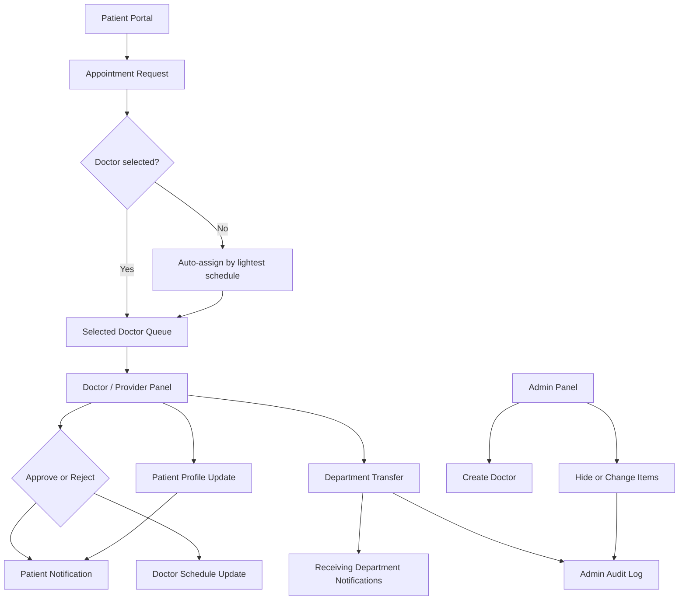
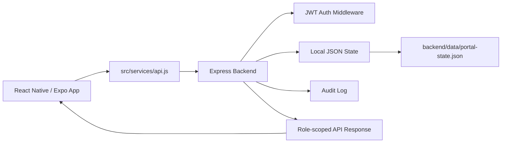

# CareBridge Workflow and Gap Analysis

This document explains how the CareBridge portal currently works, how the Patient, Doctor/Provider, and Admin roles interact, and where the project still has gaps before it could become a production-ready healthcare application.

## Workflow Summary

CareBridge has three connected roles:

- Patient: books visits, selects a department/doctor, reads notifications, sends messages, and views records.
- Doctor/Provider: reviews appointment requests, approves or rejects requests, updates patient profiles, creates patients, and transfers patients between departments.
- Admin: creates doctor profiles, monitors departments, reviews audit logs, and hides or changes operational items without deleting them.



## User Journey Workflows

### 1. Authentication Workflow

1. User opens the Expo or web app.
2. App checks browser session storage for a previous session.
3. If a valid local session exists, the app restores the user.
4. If a backend JWT exists, the app reloads `/api/portal`.
5. If the JWT expired, the app clears the session and asks the user to sign in again.
6. If no session exists, the login/register screen is shown.
7. On login/register, the backend returns a JWT and public user profile.
8. The app saves a safe session and loads role-specific data.
9. Sign out clears the local session.

Current files:

- `App.js`
- `src/services/sessionStorage.js`
- `backend/server.js`

### 2. Patient Appointment Workflow

1. Patient opens `Appointments`.
2. Patient chooses a department.
3. Patient may choose a specific doctor.
4. If no doctor is selected, the app assigns the doctor with the lightest schedule.
5. Patient submits the request.
6. Backend creates an appointment with status `Pending`.
7. Backend adds a doctor schedule item.
8. Backend notifies the assigned doctor.
9. Doctor sees the request in the provider dashboard/appointments view.
10. Doctor approves or rejects.
11. Appointment status and doctor schedule status are updated.
12. Patient receives a notification.
13. Audit log records the action.

Main API routes:

```text
POST  /api/appointments
PATCH /api/appointments/:id/status
```

### 3. Doctor Patient Profile Workflow

1. Doctor opens `Records`.
2. Doctor selects a patient from their scoped department list.
3. Doctor edits the care summary.
4. Backend checks that the doctor belongs to the patient's department.
5. Backend updates the patient profile summary.
6. Patient receives a notification naming the doctor and patient.
7. Audit log records the update.

Main API route:

```text
PATCH /api/patient-profile
```

### 4. Patient Transfer Workflow

1. Doctor opens `Records`.
2. Doctor selects a patient.
3. Doctor chooses another department.
4. Doctor enters the transfer reason.
5. Backend confirms the doctor has access to the source department.
6. Backend moves the patient from source department to target department.
7. Patient status becomes `Transferred`.
8. Patient care team and plan are updated.
9. Patient receives a transfer notification.
10. Receiving department doctors receive incoming transfer notifications.
11. Admin receives a transfer audit notification.
12. Audit log records a critical event.

Main API route:

```text
PATCH /api/patients/:id/transfer
```

### 5. Admin Operations Workflow

1. Admin opens `Admin`.
2. Admin can review departments, doctors, patients, and operational metrics.
3. Admin creates doctor profiles and assigns them to departments.
4. Admin can hide/show or change appointment, message, and notification items.
5. Admin cannot delete operational items.
6. Admin reviews read-only audit logs.

Main API routes:

```text
POST  /api/doctors
PATCH /api/admin/items/:collection/:id
GET   /api/audit-logs
```

## Data Flow



Current persistence is local JSON:

```text
backend/data/portal-state.json
```

This is good for a classroom demo because it survives backend restarts. It is not a production database.

## Current Strengths

- Clear Patient, Doctor/Provider, and Admin role separation in the UI.
- Backend JWT authentication and bcrypt password hashing.
- Role-specific dashboards and navigation.
- Provider access is scoped by department for patient updates and transfers.
- Appointment requests update doctor schedules and notifications.
- Admin audit log is read-only in the UI.
- Local JSON persistence prevents demo data from resetting on every backend restart.
- Mobile and web support through Expo.
- Project is now split into data, screens, components, services, utilities, and styles.

## Gap Closure Status

The following gaps from the first review have now been converted into working project behavior:

| Gap | Implemented Closure |
| --- | --- |
| Message privacy | Messages now carry patient, department, sender, receiver, and doctor context. Frontend and backend filtering only show messages that belong to the current role. |
| Search privacy | Search now uses the same scoped records, messages, appointments, transfers, resources, and admin items that the portal view uses. |
| Per-patient records | Medical records now include patient and department ownership. Profile updates create patient-specific provider notes. |
| Transfer acceptance | A transfer request is now created first. Receiving department doctors or admins can accept or reject it. |
| Appointment conflicts | Requested doctors are checked for same-time schedule conflicts. Auto-assignment only chooses an available doctor. |
| Admin coverage | Admin can now manage medical records and transfer requests in addition to appointments, messages, and notifications. |
| Visible error handling | Sync and validation failures now show a visible dismissible app message instead of silently falling back. |
| Auto-lock | The app now locks/signs out the browser session after inactivity. |

## Current Gap Analysis

### High Priority Gaps

| Gap | Current State | Risk | Recommended Fix |
| --- | --- | --- | --- |
| Local storage session | Web session is stored in browser localStorage. | Works for demo, but not ideal for sensitive production auth. | Use secure native storage on mobile and httpOnly refresh-token cookies or managed auth on web. |
| No production database | Runtime data is stored in one JSON file. | Concurrent users and large data sets are not safe. | Move to SQLite, PostgreSQL, Firebase, or Supabase. |

### Medium Priority Gaps

| Gap | Current State | Risk | Recommended Fix |
| --- | --- | --- | --- |
| Validation is basic | Backend validates some required fields but accepts broad strings. | Bad or inconsistent demo data can enter state. | Add schemas with Zod/Joi or explicit validators. |
| Real-time sync | The UI reloads data after actions and keeps local state in sync for the current session. | Separate devices may need refresh to see every update. | Add WebSockets, Server-Sent Events, Firebase realtime, or periodic polling. |

### Lower Priority Gaps

| Gap | Current State | Recommended Fix |
| --- | --- | --- |
| Password reset | Not implemented. | Add forgot-password demo flow or admin reset flow. |
| MFA is visual | MFA status/toggle is demo UI only. | Document as simulated or integrate real MFA. |
| Auto-lock polish | Inactivity lock exists, but there is no dedicated lock-screen PIN. | Add a lock screen with quick re-auth. |
| File uploads | No upload for insurance card, lab files, images, or documents. | Add local file picker and backend attachment model. |
| Tests | Build and syntax checks exist, but no unit/API tests. | Add API route tests and role-scope tests. |
| Accessibility pass | UI is readable, but not fully audited. | Add labels, focus order checks, and contrast review. |

## Recommended Next Implementation Order

1. Add API tests for role permissions.
2. Add stronger schema validation.
3. Replace local JSON persistence with SQLite or PostgreSQL.
4. Add realtime sync after database boundaries are stable.
5. Replace demo MFA/session storage with production-grade auth.

## Demo Workflow For Presentation

Use this sequence to show the project as a practical clinic application:

1. Login as patient `maya@care.test`.
2. Book an appointment and choose a department.
3. Leave doctor unselected once to show automatic assignment.
4. Login as the assigned doctor.
5. Approve or reject the pending appointment.
6. Return to the patient account and show the notification.
7. Login as doctor again.
8. Update a selected patient's profile.
9. Transfer that patient to another department.
10. Login as a receiving department doctor and show the incoming transfer notification.
11. Login as admin.
12. Show doctor creation, hide/change controls, and read-only audit logs.

## Definition Of Done For A More Practical Version

The app becomes closer to a real-world portal when these are true:

- Every patient has independent records, messages, appointments, profile, and notifications.
- Every API route enforces the same role-scoping rules.
- Doctors can only see assigned or transferred patients.
- Admin actions are audit logged and cannot delete data.
- Refresh, backend restart, and Expo Go reload do not lose the active demo state.
- Search never returns data outside the user's permission scope.
- Transfers and appointment decisions produce visible notifications for all affected roles.
- The README clearly explains how to run the demo on web and mobile.
